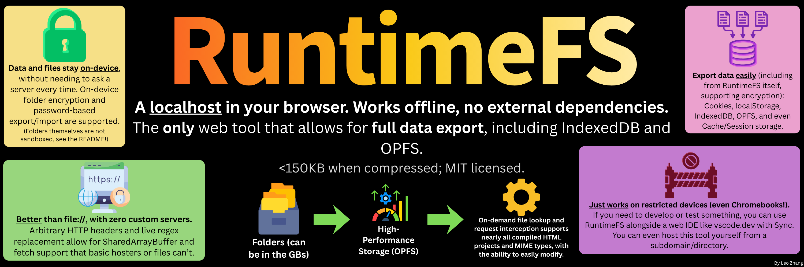

# RuntimeFS

View the [working demo](https://plasma4.org/projects/RuntimeFS/)!

RuntimeFS is a no-nonsense `OPFS` and `ServiceWorker` file-system, served in your browser, allowing you to import custom folders and access them like a localhost. It allows you to open HTML projects, use some encryption techniques, and comes with **full offline** and **complete .tar.gz or encrypted data export** functionality.

Imagine an offline localhost, in your browser with no server-based storage of files. It saves all files and data locally, and can easily be integrated within an existing website too (the code is MIT Licensed, and less than 100KB).

After the initial page loads, RuntimeFS no longer needs internet connection to function. RuntimeFS also supports in-place opening of files, which doesn't require opening another tab.

## Dependencies and Requirements

RuntimeFS utilizes [cbor-x](https://github.com/kriszyp/cbor-x) and my own [LittleExport](https://github.com/plasma4/LittleExport) tool. The entire application is MIT-Licensed. (LittleExport is integrated directly into RuntimeFS; no so separate license file is required for that.) Only `main.min.js`, `sw.min.js`, and `index.html` are required for RuntimeFS to function.

Make sure to modify `APP_SHELL_FILES` in the SW and `SW_LINK` in the main code if you are changing the file configuration for proper caching. (Code is minified by using [JSCompress](https://jscompress.com/), which uses `UglifyJS` 3 and `babel-minify`.)

## Usage

You can use Enter on text inputs to perform actions, instead of clicking buttons. On the Folder to Open section text inputs you can use Shift+Enter to open in-place and Ctrl/Cmd+Enter to sync and open. (Syncing will only show up after uploading a folder, through a supported browser. Drag-and-drop should work for all browsers but won't allow syncing.)

Custom regex and headers save on reload or export but do not affect stored files; they simply modify headers when opening a file in the `/n/` virtual path from the RuntimeFS menu (reloading or navigating to the URL directly do not yet). Many headers won't work when opening in-place like CORS.

It's possible to import or export specified data types in the Data Management menu, and you can also drag-and-drop import files (.tar.gz or .enc).

To update to a newer version, a single-file plugin exists for customizing cache in `plugin/index.html` (or simply to request an update), allowing for you to fully customize RuntimeFS from any site hosting it. Note that simply hard reloading won't update the cache. If this isn't included in the way you use RuntimeFS, you can upload it as a virtual folder. Example link with the demo [here](https://plasma4.org/projects/RuntimeFS/plugin/).

## Browser Support

File System API features (such as syncing or folder encryption) are Chromium-exclusive, and these options will be hidden in other browsers. RuntimeFS has been tested in Chromium, Firefox, and Safari.

Firefox with Private browsing is known not allow folder uploading, and similar issues might occur in "hardened" browsers or browsing modes.

(Firefox had a very specific issue involving initially loading JS scripts in `generateResponseForVirtualFile`, so an automatic reload is performed that injects `?boot=1` to the end of the URL. However, this issue seems to no longer happen in the newest versions of Firefox so see `reloadOnRequest` in the SW code and its comment to re-enable `?boot=1` injection.)

In the future, non-Chromium browsers might adopt parts of the File System API that allow for streamed exports. The RAM-only fallback should still work for exporting a few hundred MBs.

RuntimeFS requires ES11 or later (supported by over 95% of all browsers).

| Feature                           | 🟢 Chromium                | 🟡 Firefox/Safari/Brave                         |
| :-------------------------------- | :------------------------- | :---------------------------------------------- |
| **Folder Upload**                 | ✅ Yes                     | ⚠️ `<input>` or drag-and-drop fallback, no sync |
| **Encryption (folder-based)**     | ✅ Yes                     | ❌ No                                           |
| **Export (including encryption)** | ✅ Mostly streamed to disk | ⚠️ RAM-only                                     |

## URL Persistence & Location Spoofing

URL Persistence is an informal term that means that websites store data along with URLs. Examples include the Ruffle emulator (in `localStorage`) and Unity (in `IndexedDB`). If you export data from `example.com/v1/` and try to import it to `example.com/v2/` (or to different domains), it probably won't work.

Because of this problem, you must normalize these URL keys during exporting or importing with a mock location object (and replace `document.URL` if needed). See a **standardized** RuntimeFS location spoofer and more details are in the [LittleExport](https://github.com/plasma4/LittleExport) repo.

## Notes

There are also additional (private) variations of RuntimeFS for site hosters and developers, so do reach out to me on Discord (`@1_e0`) if you need a better implementation, encounter issues, or need clarification!

Not all applications will work! Out of the many sites I tested, there were the main reasons why they broke, even with trying custom headers:

- The application requests something externally (this might not always break, but sometimes sites are strict!). ServiceWorkers cannot intercept these anyway.
- Somewhere in the application, sync AJAX is used. There is sadly no simple workaround. (This type of request is also being phased out from browsers gradually; I've tried getting this working with `Atomics` and web workers but it sadly isn't fixable.)
- The application isn't compiled yet, such as on a Vite GitHub download.
- The application requests URLs from root (`/`). The current version has some fetch interception for this, but it's not guaranteed to work for everything (or, custom `<base>` elements might actually interfere). This might be fixable with `<base href="/n/FolderName">`.
- Theoretically, a giant single IndexedDB record or USTAR limitations (like very long file names or files over 8.5GB) will prevent data from being exportable.

> [!WARNING]
> Folders are **not sandboxed**! Because RuntimeFS serves files from the same origin, uploaded scripts have unrestricted access to local data (including `localStorage`, `IndexedDB`, and `OPFS`).
>
> In theory, a malicious site hosted inside RuntimeFS could exfiltrate your data. Keep in mind you are basically using a localhost **but without subdomain/site isolation**. If this is a concern, use Content-Security-Policy (CSP) headers to stop external requests.

Also note:

- File names are case-sensitive.
- On first load, uploading a folder in Firefox and opening it might not work; reloading should fix this issue.
- Using the tool in Incognito will probably fail due to restrictions on memory or ServiceWorkers (browser dependent).
- Some headers like CSP currently **do not work** for in-place opening. Headers might also pose security risks!
- Cookie exporting does not store `max-age`; only the key and value.
- Some extensions, such as Chrome compatibility plugins for Firefox, might actively interfere with the features presented. Make sure that your extensions aren't breaking anything!
- The most likely reason that data export fails when transferring between sites is because those websites use URL properties as part of the key (either from `document.URL` or `location`). You might be able to force a site to use a hardcoded URL for storage with clever regex or code changes.
- Using regex requires any matched files to be fully loaded into memory, reducing performance. Be careful!
- There may be some highly specific crash cases when exporting; check LittleExport documentation for details.
- `.cbor` files are non-standard (`with bundleStrings`). To read a more JS-friendly version of these files, please check LittleExport documentation.
- Regex attempts to only operate on text files; the checking should be performant and accurate for almost all cases. You can customize the `isActuallyText` function in the SW if necessary.
- Check `getMimeType` in the ServiceWorker for the supported MIME types; you may need to add your own in some cases.
- You might encounter freezing of all RuntimeFS-related tabs if any tab is stuck or waiting for something (such as making a IndexedDB writable). RuntimeFS might also encounter a QuotaExceededError in certain situations (like running out of memory or private tabs).

### TODO

- RuntimeCode, an MIT-licensed fork of VSCode that integrates with RuntimeFS with dedicated web development components, plus Eruda to act as a fake inspector
- More plugin features with granular export options
- LittleExport improvements (see its [dedicated repo](https://github.com/plasma4/LittleExport))
- More complete documentation
